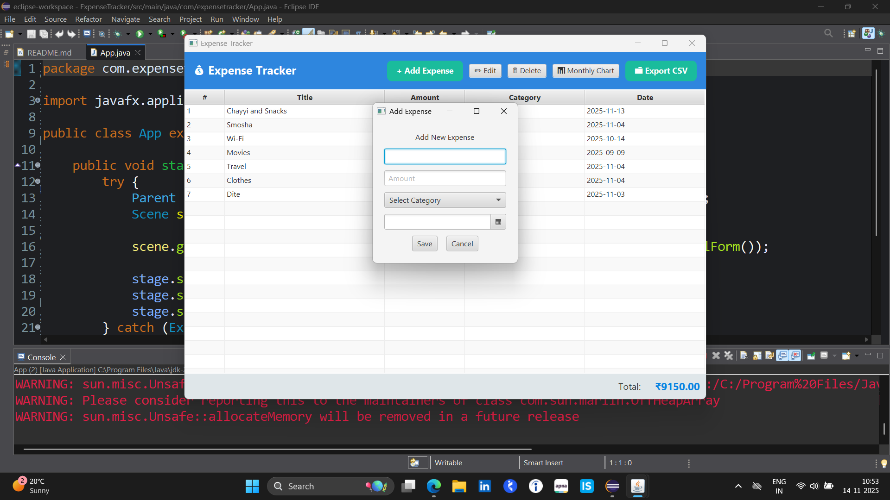
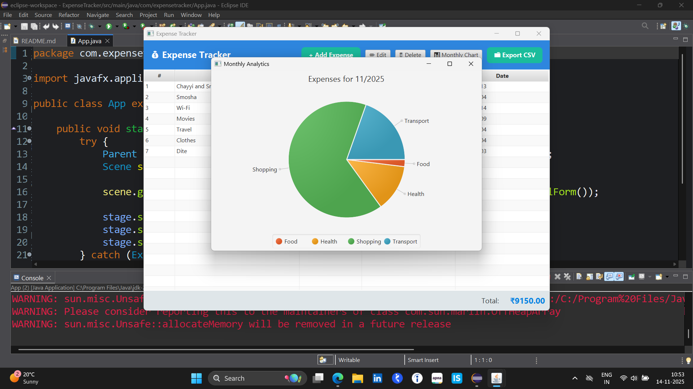

#  # 1 Project- RESTful Bookstore API

## Objective

A simple RESTful Bookstore API to manage **Authors** and **Books** using **Spring Boot**, **JPA**, and **H2 Database**.This API allows you to perform CRUD operations for Authors and Books, including querying books by author or title.

---

## Technologies

- **Language:** Java
- **FrameWork:** Spring Boot
- **Database:** H2 (in-memory)
- **ORM:** JPA / Hibernate
- **Build Tool:** Maven
- **IDE:** Eclipse

---

## Features

**Author**
- Create an author
- Get all authors
- Get author by ID
- Update author
- Delete author
  
**Book**
- Add a book linked to an author
- Get all books
- Get books by author
- Get books by title
- Update book
- Delete book

---

### API Endpoints

**Author**
- GET `/api/authors/` – Get all authors
- GET `/api/authors/{id}` – Get author by ID
- POST `/api/authors/` – Create a new author
- PUT `/api/authors/{id}` – Update an author
- DELETE `/api/authors/{id}` – Delete an author

**Book**
- POST `/api/books/add/{authorId}` – Add a book for an author
- GET `/api/books/All` – Get all books
- GET `/api/books/{authorId}` – Get books by author
- GET `/api/books/title{title}` – Get books by title
- PUT `/api/books/update/{id}` – Update a book
- DELETE `/api/books/delete/{id}` – Delete a book

---


### Prerequisites
- Java 17+ installed
- Maven installed (or IDW with Maven support)

## How to run

1. Navigate to the project directory:
```bash 
	cd path/to/bookstore-api
```

2. Compile the project:
```bash
	mvn clean install
```
3. Run the Spring Boot application:
```bash
	mvn spring-boot:run
```

--- 

**Note**
- Auto-generate unique book codes.
- Proper HTTP status codes used in all responses.
- Handles invalid operations with descriptive messages.

---

# # 2 Project- Expense Tracker API with Monthly

## Objective

A simple and user-friendly desktop-based Expense Tracker application built using JavaFX, SQLite, and Maven.
This application allows users to Add, Edit, Delete, and View expenses, along with calculating total monthly spending.

---

## Technologies

- **Language:** Java
- **UI FrameWork:** JavaFx (FXML + CSS)
- **Database:** SQLite
- **Database Access:** JDBC
- **Charts:** JFreeChart
- **Build Tool:** Maven
- **IDE:** Eclipse


---

## Features

**Expense Management**
- Add new expense
- Edit existing expense
- Delete expense
- Display all expenses in a clean JavaFX TableView
- Auto-caclulating total spending
  
**Categories Supported**
- Food
- Transport
- Shopping
- Bills
- Health
- Entertainment
- Other

**Database**
- Local SQlite database(expense_tracker.db)
- Auto-created on first launch
- Expenses saved permanently

**Monthly Analytics (Pie/Bar Charts)**
- Monthly Analytics” button opens a popup window
- Shows category-wise monthly spending using a Pie Chart
- Chart auto-generates using SQL monthly summary
- Helps understand spending patterns visually

**Export Data as CSV**
- A dedicated Export CSV button is provided
- All table data (ID, Title, Amount, Category, Date) is exported with a single click
- The CSV file can be opened directly in Excel, Google Sheets, or any spreadsheet software
- Useful for backups, financial tracking, and report generation 

---

## How to run

1. Navigate to the project directory:
```bash 
	cd path/to/expense-tracker
```

2. Compile the project:
```bash
	mvn clean install
```
3. Run the Spring Boot application:
```bash
	mvn javafx:run
```

--- 

## Notes

- Work Offline
- No internet requried
- DB auto-created
- Clean modular structure for easy modification
- Smooth navigation (Dashboard + Add/Edit + Analytics)

---





